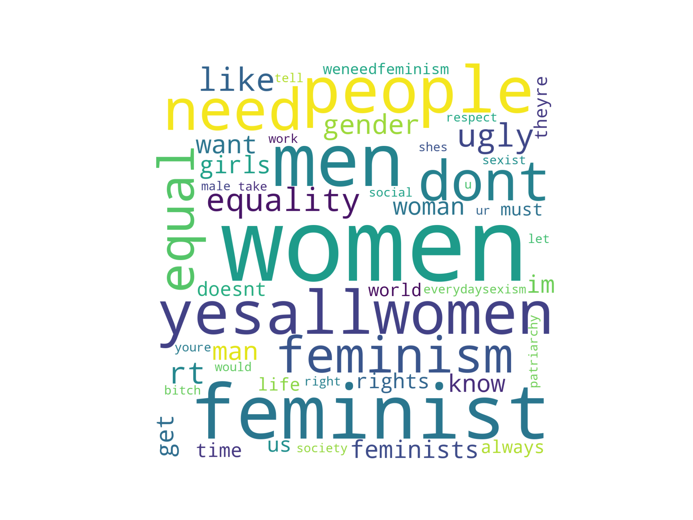

# Word clouds

Playing around with word clouds using the _Progressive issues sentiment analysis_ data set from [Figure Eight](https://www.figure-eight.com/data-for-everyone/).  This data set classified tweets concerning the `Legalisation of Abortion`, the `Feminism Movement`, `Hillary Clinton` and `Atheism`, as `For`, `Against`, `Neutral` or `None of the above`.

Here's a word cloud using the top 50 most frequent words in tweets For the Feminist Movement.

